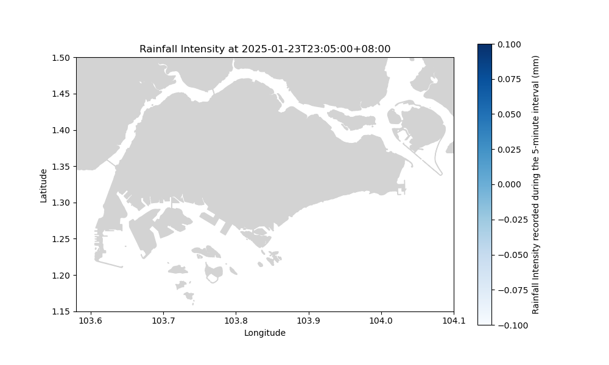

# RainWard (still work-in-progress!)
From personal experience, it seems like rain in Singapore is becoming increasingly unpredictable. It is now significantly harder to guess if it will rain over one's estate or not, and therefore, significantly harder to make a decision on whether or not to leave one's laundry out to dry or not. RainWard aims to inform users of the current rain areas over Singapore as well as the 2-hour forecast over every town in Singapore. 

I have not really settled on how I want to implement RainWard as a program yet, but as of now the repository contains the core scripts to perform it's core tasks:
1. visualising accumulated readings of all rain gauges in Singapore for the past 5 minutes and 
2. visualising current 2-hour forecasts for every township in Singapore.

# How to use
There is no user-interface yet, but there are 2 main scripts in the ```scripts/``` directory that can be run.
1.  ```visualise.py``` which outputs a plot of the most updated 5 minute rainfall readings from Singapore's extensive rain gauge network.
2. ```forecastvisualise.py``` which outputs a plot of the most updated 2-hour weather forecast over every town in Singapore.

# Example of usage
On a relatively dry period with little to no rainfall being registered in the rain gauge network, upon running the ```scripts/visualise.py``` script, expect to see a plot that looks something like this:


On a cloudy day, upon running the ```scripts/forecastvisualise.py``` script, expect to see a plot that looks like this:
~[](figures/Cloudyday.png)

## Miscellaneous script
```periodicscript.py``` is a script that when run, pulls the 2-hour forecast data over Tampines every 10 minutes and cumulatively writes this into ```data.csv``` located in the ```data/``` directory. I am currently using this script to keep a record of what was forecasted over Tampines and what time the forecasts were made. (Maybe in future, I can do some analytics with the data).